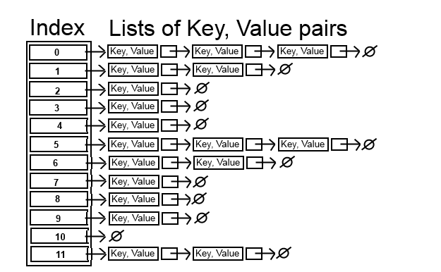

# MIPT Assembly task Hash Table
**Basic structure of hash table:**
Hash table is an array of lists, each lists handles objects with the same hash. Array index of list is hash of its objects. So it looks like this:

**Hash functions dispersion:**

I have selected a few hash function to compare their dispersion characteristics:
1. Constant hash
2. Length of word
3. Sum of characters ASCII-codes divided by word length
4. Rolling ASCII-codes hash
5. Jenkins hash

Dispersion tables for this hashes on 24000 word set:

As you can see, *Rolling hash* and *Jenkins* were the best choices.

**Optimization:**
Before starting optimization I've needed to determine which functions to optimize, so I've started profiling my program. 

Profiling results:

It's obvious that hash function and string functions such as strcmp and strlen were bottlenecks.

The main idea about optimizing string functions was to make each word 48-characters long by adding zeroes to the end, so determining whether strings are equal or not will be ass easy as doing xor of two x64 registers. This way we can compare 8 words in one processor cycle, and with average length of word equal to 7 characters it gives us significant speed up. You can find this fucntions in `faster_string_functions.h`.

Talking about Jenkins hash, everything we can do about it is - just rewrite in it assembly using bitwise operation, which are faster, than usual arithmetic operations.

Profiling after optimizations:

Now let's compare hash table optimized with assembly with hash table compiled with `-O0`, `-O1` and `-O3` flags:

As we can see, assembly optimization is much faster even than `-O3` compiler optimization.
